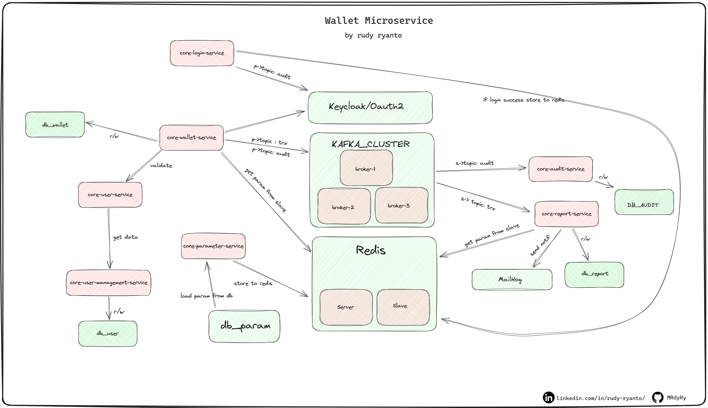

# infrastructure-wallet
infrastructure for demo project wallet

- <a href="https://github.com/MRdyRy/core-service-registry">service-registry</a> 
- <a href="https://github.com/MRdyRy/core-gateway">gateway</a>
- <a href="https://github.com/MRdyRy/core-audit-service">audit</a>
- <a href="https://github.com/MRdyRy/core-parameter-service">parameter</a>
- <a href="https://github.com/MRdyRy/core-report-service">report/notif</a>
- <a href="https://github.com/MRdyRy/core-user-service">user</a>
- <a href="https://github.com/MRdyRy/core-user-management-service">user-management</a>
- <a href="https://github.com/MRdyRy/core-wallet-service">wallet</a>
- <a href="https://github.com/MRdyRy/common-config">common config</a>
- <a href="https://github.com/MRdyRy/core-parent">parent</a>
- <a href="#">Infrastructure</a> : 
    - postgresql
    - redis
    - kafka
    - keycloak

# architecture:

